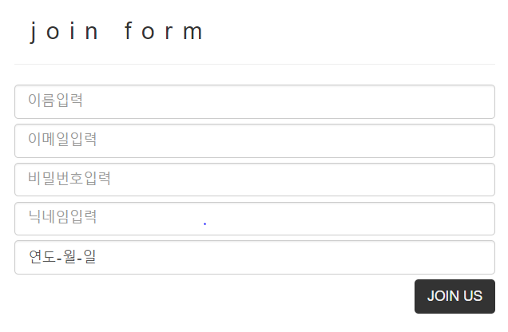
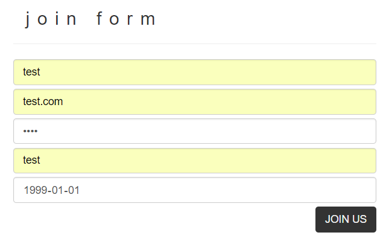
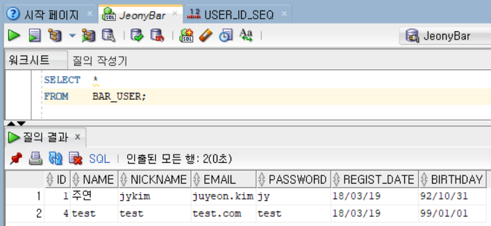

# BarProject
----
## 1. 현재 진행 상황 
* 회원가입 로그인 부분 :: DB 연결중
1. pom.xml    
: dependency 추가    
2. view/user/login.jsp & join.jsp     
: 수정    
3. mybatis.xml    
: 패키지 alias, mapper    
```
<typeAliases>
        <typeAlias type="com.bar.user.vo.UserVO" alias="UserVO"/> 
</typeAliases>
<mappers>
        <mapper resource="com/bar/user/dao/sql/userDao.xml"/>
</mappers>
```
4. rootContext.xml    
: 복붙 - 패키지명, username, password 변경    
5. DAO, DaoImpl, Service, ServiceImpl, Controller    
6. applicationContext.xml    
: 의존성 추가    
```
<!--회원가입 컨트롤러!!! -->
<bean id="userController" class="com.bar.user.web.UserController">
        <!-- 프로퍼티 추가!! -->
        <property name="userService" ref="userService"/>
</bean>
	
<!-- 디비 연걸 -->
<bean id="userDao" class="com.bar.user.dao.UserDaoImplForOracle">
	<property name="sqlSessionTemplate" ref="sqlSessionTemplate"></property>
</bean>
<bean id="userService" class="com.bar.user.service.UserServiceImpl">
	<property name="userDao" ref="userDao" />
</bean>
```
7. 

### 1.1 프로젝트 생성 및 설정


### 1.2 DB TABLE


### 1.3 VIEW



http://192.168.201.17:8080/jb/main
        
### 1.4 TODO
* LOGIN & JOIN :: DB 연결해서 완성
- Session!!
* ~ Context.xml :: 파일 분리

